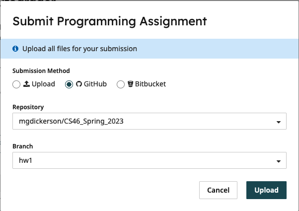

# ICS 46: Homework 1

Welcome to ICS 46 Homework 1! Instructions from this point on will assume the use
of `GitHub`. If you are working without `github`, then copy the
[Directory Structure](#directory-structure).

## Getting Started

If you are using `GitHub`, then it is likely you will have already cloned this repository!
If you have not, or removed the folder for any reason, then you will need to clone your
private repository first:

```bash
# Clone your private repository
git clone <YourPrivateRepositorySSHLink>

# Change Directory into your project folder
cd <PrivateProjectName>
```

Next, we will checkout the `hw1` branch. In the same terminal as before, you will type:

```bash
git checkout hw1
```

## Directory Structure

If you are not using `GitHub`, and want to use our testing framework, you will need to make a folder
named `hw1` with the following structure:

```bash
├── CMakeLists.txt
├── CMakePresets.json
├── gtest
│   ├── gtestmain.cpp
│   ├── alloc_gtests.cpp
│   └── string_gtests.cpp
└── src
    ├── Alloc.cpp
    ├── Alloc.h
    ├── main.cpp
    ├── String.cpp
    └── String.h
```

You should copy everything from the `CMakeLists.txt` and `CMakePresets.json` files into your own,
as well as the files `gtestmain.cpp` and the individual `gtests`. This will allow you to build and run the
tests for this assignment. If you do not follow this structure, you will not be able to use the
`CMakeLists.txt` file as provided!

## Build Instructions

If you are not already in a terminal (or ssh with OpenLab) from the above instructions, you will need
to open a terminal and move into your project folder as show below:

```bash
cd <YourProjectPath>    # So if we had the project in a folder named Projects: cd Projects/CS46
```

This time, we are going to go into a little more detail on how `CMake` works. The `CMake` process is
basically comprised of two steps: producing project build files and actually building the project.
To produce the build files for our project we run the first command:

```bash
# Build Generator Command
cmake --preset deafult # Create a folder named `build` and run `CMake` to produce build files there
```

This command needs to be run at least once. Once it has been run, you will not need to run it again
unless you add new files that were not previously added to the project (or if you change the 
`CMakeLists.txt` file). If you add files or change `CMakeLists.txt`, then you can simply re-run
the command above and it will update the `build` files that it produced before. Once you have the
`build` folder and files, you will want to build the actual program. This can be done two ways.
You can either build everything at once:

```bash
# Target Build Command
cmake --build build   # Will build all of the `targets` described in the `CMake` file
```

Or you can pick a specific target to build. For this homework, there are 3 possible `targets`:
`hw` (which is the `main.cpp` file you created above), `string_gtests` (`string_gtests.cpp`), and
`alloc_gtests` (`alloc_gtests.cpp`). These `targets` are defined in the `CMakeLists.txt` file
as `project(<name>)`, so if you want to find the `targets` yourself, you can always check that
file. We will also always give you the available `targets` in this class. Below are the individual
`target` commands you can run:

```bash
# Build only main.cpp:
cmake --build build --target hw

# Build only Alloc tests:
cmake --build build --target alloc_gtests

# Build only String tests:
cmake --build build --target string_gtests
```

NOTE: If you build all targets with the `cmake --build build` command, you DO NOT need to
run the individual commands. The advantage of running the individual build commands is
being able to build only the parts you want to test. Also, unlike the Build Generator 
Command (`cmake --preset default`), you will need to run the Target Build Command 
(`cmake --build build <--target target>`) every time you make changes to your `*.cpp` or `*.h`
files. For example, if you build `string_gtests.cpp`, and find out that your `indexOf` does
not work for `Strings` size 2, you will need to change `string.h`. Once you have
changed it, when you want to test it again, you can run:

```bash
cmake --build build --target string_gtests
```

And it will build just that code with your updated changes! Very handy for testing one task
at a time.

After you have built your intended target, you will have three new executables you can run!
You will have `hw` which will be the code from `main.cpp`, `string_gtests`, and `alloc_gtests`.
You can run each one with the commands shown below:

```bash
./build/hw            # Runs the 'main' function from src/main.cpp
./build/alloc_gtests   # Runs the 'alloc' gtest set of tests
./build/string_gtests  # Runs the 'String' gtests
```

Once you have run the code above and it either produces the output you expected or passes
all provided tests, congratulations! You are now ready to [submit](#submission) your homework!

## Submission

All submissions will be done through [Gradescope](https://www.gradescope.com/). Open the Gradescope page
and select `HW1`. Now if you are using a `GitHub` account, follow the [GitHub Submission](#github-submission)
instructions, otherwise follow the [File Submission](#file-submission) instructions.

### GitHub Submission

First, we need to make sure that we commit all of our changes we made! In a terminal inside your project folder,
run the following command:

```bash
git commit -a -m "Submission commit of HW1."
```

Now that we have committed out changes, we need to push them to `GitHub` so that `Gradescope` can see them.

```bash
git push
```

Now on Gradescope, press the submit button, choose the `GitHub` option, and select your project and branch
as shown below:



Now the autograder will run and give you a score!

### File Submission

On `Gradescope`, press the `submit` button and it will bring up the following window:


Then you will drag and drop the `main.cpp`, `String.h`, `String.cpp`, `Alloc.h`, and `Alloc.cpp` files from your `src` folder
(or wherever you have made this file) and press upload. As these are the only files we are changing, they
should be the only files that you upload!
